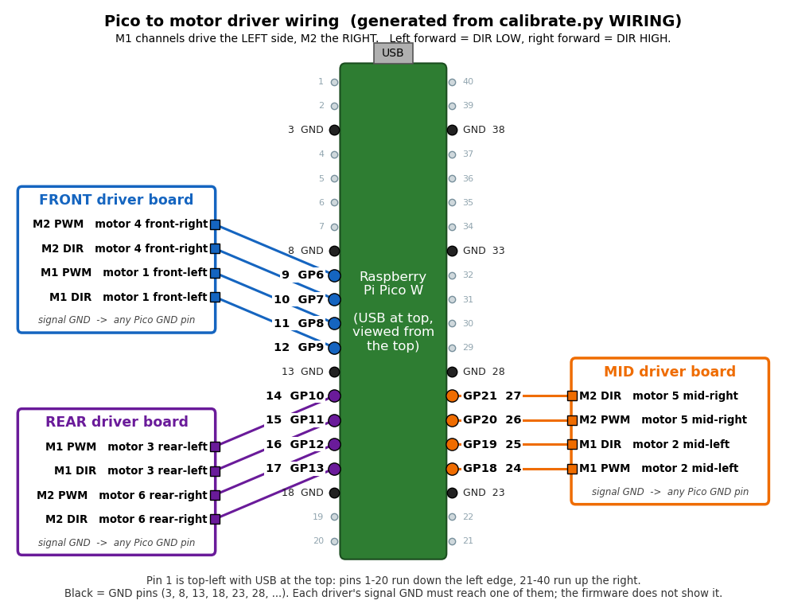

# athena_drive

Motor drive for the Athena rover: `/cmd_vel` -> Raspberry Pi Pico W -> 6 DC
motors, plus the tools to check the wiring and calibrate the speeds.

## Safety

- **Prop the rover up so the wheels spin free for every test**, except
  `calibrate` stage 4 and `calibrate_speed -p mode:=topspeed`, which drive on the
  floor to measure distance and say so before they move. A reversed motor found on
  the bench is a five-minute fix; found on the floor it is a chase.
- Two watchdogs: `motor_bridge` zeroes its command if `/cmd_vel` is stale for
  0.5 s, and the Pico firmware stops the motors if serial is quiet for 500 ms.
  Pulling the Pico's USB cable is the fastest stop you have.
- **The Pico's serial port is exclusive.** `motor_bridge`, `calibrate`,
  `wiring_check` and `calibrate_speed` all want it, and `bringup.launch.py` already
  starts a `motor_bridge`. The second one loses, quietly: `calibrate` exits with
  `could not open`; a second bridge logs `could not open ... - running dry` and
  streams to nothing. A port conflict is the commonest cause of "`/cmd_vel` does
  nothing". Stop the stack before using the calibration tools, and check who
  holds the port with:

```bash
fuser -v /dev/ttyACM*
```

## Quick start

```bash
# ONE TIME: guided, interactive, saves what it measures
ros2 run athena_drive calibrate

# motors only, no navigation
ros2 launch athena_drive drive.launch.py
ros2 run athena_drive teleop         # arrows drive; releasing them stops the rover
```

### What each command runs

| Command | What it runs | Opens the Pico's port? |
|---|---|---|
| `ros2 run athena_drive calibrate` | the interactive menu: motor tests, direction check, deadband, top speed, track width ([below](#calibration)) | yes |
| `ros2 launch athena_drive drive.launch.py` | one node, `motor_bridge`: turns `/cmd_vel` into `V <left> <right>` serial commands for the Pico | yes |
| `ros2 run athena_drive teleop` | a keyboard node that publishes `/cmd_vel` (arrows, `q/z` linear speed, `e/c` angular speed, space stop). Needs `motor_bridge` running to do anything | no |
| `ros2 run athena_drive wiring_check` | drives motors on a schedule, no questions asked ([modes](docs/CALIBRATION.md)) | yes |

Only one process can hold the Pico's port at a time (see Safety above).

For full navigation use `ros2 launch athena_gps_nav bringup.launch.py`, which
includes `drive.launch.py`: do not also run it yourself. A shell that skipped
`~/.bashrc` (`ssh host 'command'`, cron) also needs `ROS_DOMAIN_ID=42` and both
`setup.bash` files sourced ([why](../athena_remote/README.md#option-b-ros-cli-over-ssh)).

## Pico to motor driver pin map



GPIO number with the physical Pico header pin in brackets. Pin 1 is top-left
with USB at the top; pins 1-20 run down the left edge, 21-40 up the right.

| Motor | Driver channel | PWM | DIR |
|---|---|---|---|
| 1 front-left | FRONT M1 | GP8 (pin 11) | GP9 (pin 12) |
| 2 mid-left | MID M1 | GP18 (pin 24) | GP19 (pin 25) |
| 3 rear-left | REAR M1 | GP10 (pin 14) | GP11 (pin 15) |
| 4 front-right | FRONT M2 | GP6 (pin 9) | GP7 (pin 10) |
| 5 mid-right | MID M2 | GP20 (pin 26) | GP21 (pin 27) |
| 6 rear-right | REAR M2 | GP12 (pin 16) | GP13 (pin 17) |

- Left forward = DIR **LOW**, right forward = DIR **HIGH**.
- Each driver's signal GND must also go to a Pico GND pin (3, 8, 13, 18, 23, 28).
  This is not in the firmware.
- **Source of truth:** this table mirrors the `#define`s at the top of
  `firmware/athena_drive_fw/athena_drive_fw.ino` and the `WIRING` table in
  `athena_drive/calibrate.py`. If a wire moves to another GPIO, change **both**,
  reflash, and re-run `python3 ../docs/img/pico_wiring.py` to redraw the picture
  (it refuses to draw if the two files disagree).
- Board and channel names (FRONT/MID/REAR, M1/M2) are the firmware's
  `FRONT_M1` / `MID_M2` ... labels, not verified against the physical driver boards.
- `calibrate` menu `w` prints this map from the same table.

## Calibration

`ros2 run athena_drive calibrate` opens a menu (stop the stack first):

| Key | Does |
|---|---|
| `m` | **Manual motor test**: pick one or more motors, a direction, confirm; only that runs |
| `d` | direction check for the motors you pick |
| `w` | wiring map (the pin map above) |
| `s` | board status and invert flags, from the Pico |
| `1`-`5` | one stage: 1 directions, 2 side check, 3 PWM deadband, 4 top speed (**drives on the floor**), 5 track width |
| `a` | stages 1-5 in order |

Skip the menu with `-p stages:=m`, `-p stages:=3,4` or `-p stages:=all`.
Several motors run together through the firmware's `G <mask> <pwm>` command
(bit 0 = motor 1). `G` is compiled in the source but **not yet flashed to the
Pico**; until it is, `calibrate` runs the chosen motors one after another and
says so before you confirm.

Stage results, motor verdicts, what is saved where and manual tools:
[docs/CALIBRATION.md](docs/CALIBRATION.md).

**State today.** `~/.config/athena_drive/params.yaml` holds `min_pwm: 20` and
`track_width: 0.85` (both measured). `max_wheel_speed` and `max_pwm` are absent,
so the bridge runs on its estimates of 0.7 m/s and 255, and `motor_bridge` logs
an `UNCALIBRATED` warning naming them at startup. Run stage 4 on the floor
(`-p stages:=4`) before trusting a commanded distance.

## Nodes

Five executables, and there are no others:

| Node | Purpose |
|---|---|
| `motor_bridge` | `/cmd_vel` -> `V <l> <r>`; the one you run for navigation |
| `calibrate` | the menu and guided stages: directions, deadband, top speed, track width |
| `wiring_check` | drives one motor, a side, or a spin, to verify direction |
| `calibrate_speed` | measures `min_pwm` and `max_wheel_speed`, prints only |
| `teleop` | keyboard driving with a dead-man release |

All but `teleop` open the Pico's serial port. Launch file `drive.launch.py`
starts `motor_bridge`; `dry_run:=true` logs commands instead of sending them.

## Key parameters (motor_bridge)

Saved calibration is used unless a value is passed; passing one overrides it for
that run only (`ros2 launch athena_drive drive.launch.py max_pwm:=120`).

| Parameter | Estimate | Saved here today | Meaning |
|---|---|---|---|
| `track_width` | 0.40 | 0.85 | m between left and right wheel centres |
| `max_wheel_speed` | 0.7 | none | m/s at full PWM; scales every velocity Nav2 commands |
| `min_pwm` | 40 | 20 | static-friction deadband |
| `max_pwm` | 255 | none | cap; lower it for cautious testing |
| `max_accel` / `max_jerk` | 0.5 / 1.0 | | m/s^2, m/s^3: how hard and how smoothly it pulls away |
| `port` | `''` | | empty = auto-detect the Pico by USB id; never hard-code `/dev/ttyACM<n>` |

Full table, the firmware handshake, kinematics and the velocity profile:
[docs/MOTOR_BRIDGE.md](docs/MOTOR_BRIDGE.md).

## Docs

| Document | Covers |
|---|---|
| [docs/CALIBRATION.md](docs/CALIBRATION.md) | the `calibrate` menu and stages, where settings live, the single-purpose tools |
| [docs/FIRMWARE.md](docs/FIRMWARE.md) | serial commands, built-in safety behaviour, flashing the Pico |
| [docs/MOTOR_BRIDGE.md](docs/MOTOR_BRIDGE.md) | all parameters, serial port rules, kinematics, velocity profile, limitations |
| [docs/TESTING.md](docs/TESTING.md) | orientation checks, teleop -> Nav2 -> obstacles bring-up, first-drive order |
| [../docs/ARCHITECTURE.md](../docs/ARCHITECTURE.md) | where this package sits in the whole system |

## Contributors

- **Jashan**: firmware, motor bridge, velocity profile, calibration wizard
