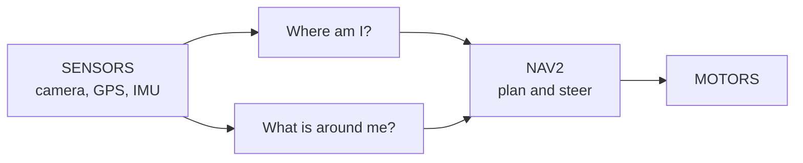
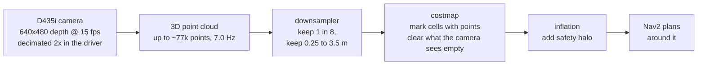
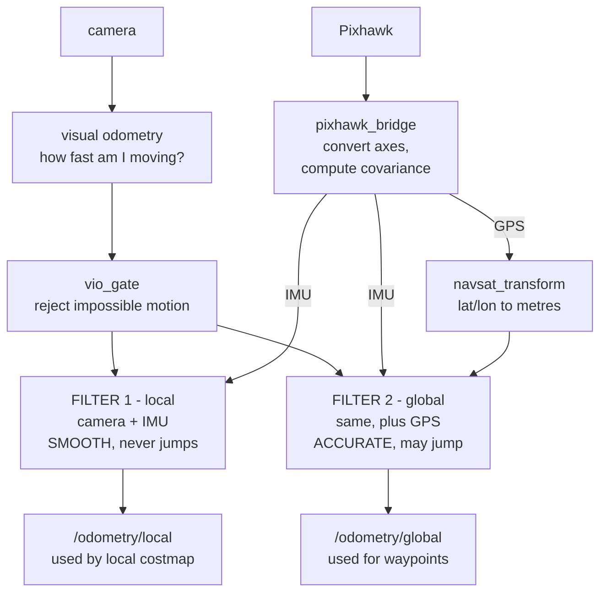
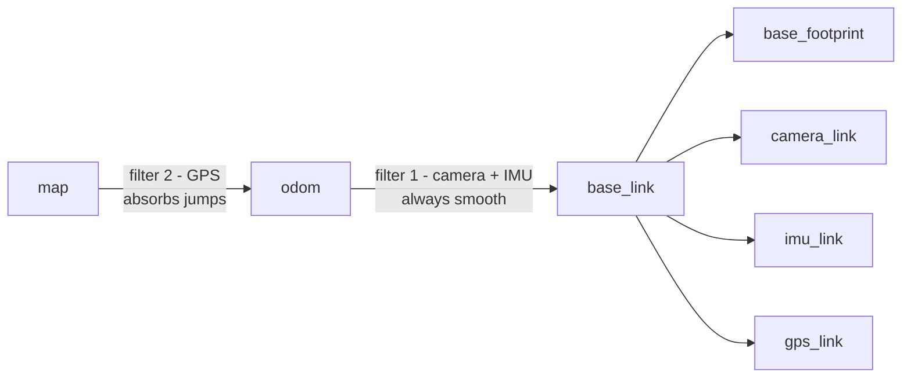
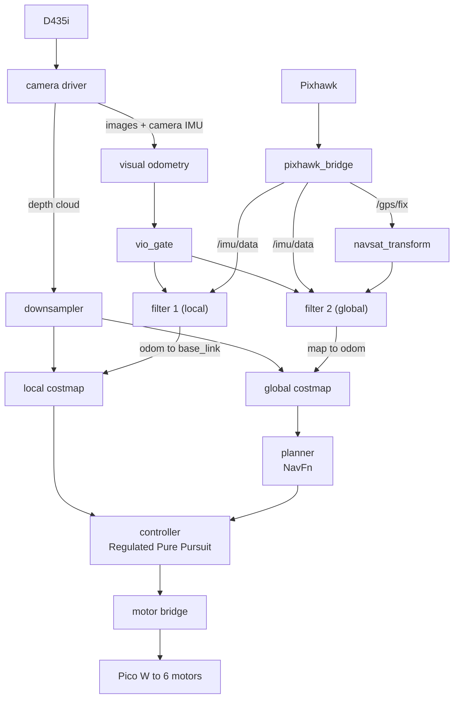

# How Athena navigates

This explains *how* the navigation stack works. If you just want to run it,
read [README.md](README.md) instead.

Read this after you have seen the stack running once. It will make far more
sense with the picture in front of you.

**Contents**

- [The big picture](#the-big-picture). The two questions the rover answers
- [What is around me?](#chain-1-what-is-around-me). Camera to obstacle map
- [Where the camera is bolted](#where-the-camera-is-bolted-and-why-it-decides-everything). The geometry the costmap believes
- [Where am I?](#chain-2-where-am-i). Three sensors into one position
- [Indoors: one filter, not two](#indoors-one-filter-not-two). What `local_only` changes and why
- [How it decides to move](#how-it-decides-to-move). Planner, controller, and the lookahead trap
- [Recovery](#recovery-why-spin-and-backup-were-removed). Why the stock tree was wrong for this rover
- [Every file in this package](#every-file-in-this-package). What each script does
- [What we did differently](#what-this-differs-from-and-why), and why the reference code did not work
- [Verified results](#verified-results). Measured numbers, not claims

---

# How it all works

Read this once you have seen the stack running. It will make more sense.

## The big picture

Everything the rover does comes down to answering two questions, then
acting on them:



Those two questions are answered by two completely separate chains that
only meet inside Nav2. That separation is deliberate: if GPS drops out, the
"what is around me" chain is untouched and the rover keeps avoiding
obstacles.

## Chain 1. What is around me?

The depth camera is the only obstacle sensor. There is no lidar.



Step by step:

1. **The camera produces a 3D point cloud**. Building that cloud is the
   most expensive stage on the Jetson, so the driver decimates the depth
   image 2x *before* the pointcloud block: 640x480 becomes 320x240, so at
   most ~77,000 points rather than the ~307,000 a full-resolution frame
   would give, and fewer again once invalid depth pixels drop out. Obstacle
   marking at 5 cm costmap resolution does not need the extra detail. Depth and colour both run at 15 fps because VO only needs
   ~10 Hz and 30 fps starves the CPU. Measured arrival rate: 7.0 Hz.
2. **The downsampler thins it.** It keeps roughly one point in eight
   (`scarcity: 8`) and discards anything past 3.5 m or closer than 0.25 m,
   the latter being self-hits on the rover's own structure. About 4,300
   points survive at 7.4 Hz, which is plenty.
3. **The costmap turns points into a grid.** Every cell containing points
   becomes an obstacle. Crucially it also does the reverse: any cell the
   camera can see *through* is erased. That is why obstacles disappear
   when you move them away.
4. **The inflation layer adds a safety halo** so Nav2 plans around
   obstacles with clearance rather than grazing them.

There are two of these maps: a small fast one near the rover for steering,
and a big slow one for planning longer routes.

| | local | global |
|---|---|---|
| frame | `odom` | `map` |
| size, resolution | 8 x 8 m @ 0.05 m | 100 x 100 m @ 0.1 m |
| inflation radius / scaling | 0.9 m / 3.0 | 1.2 m / 2.0 |
| `always_send_full_costmap` | True | False |

Both are rolling windows, because there is no prior map: the costmap
follows the rover rather than covering a fixed area. A rolling window can
only see width/2 in any direction, which is why the global one is 100 m and
not 60: at 60 m every planned leg was capped at about 30 m.

The two differences between them are the interesting part. The **global**
map shapes the route, so it inflates wider and more gently, and the planner
curves away from obstacles early rather than reacting once they are close.
The **local** map controls, so it stays tight with a steeper factor;
inflating it as wide as the global one would box the controller in and it
would start refusing gaps the rover actually fits through. Both radii must
stay at or above the footprint's circumscribed radius, `hypot(0.65, 0.5)` =
0.82 m, or there is no cost gradient covering the rover's own corner sweep.

`always_send_full_costmap` diverges for a plainer reason: at 100 x 100 m
and 0.1 m the global grid is 1e6 cells, and republishing all of them at
1 Hz is roughly 1 MB/s down an SSH tunnel. The local grid is 160 x 160
cells and costs nothing to send whole.

### Obstacles: what clears them

Both costmaps used `nav2_costmap_2d::VoxelLayer`. It clears a voxel only
when a ray from the camera passes through it to a return *behind* it, and
nothing decays. Its observation source height-filters the cloud before using
it for marking *or* clearing, so with `min_obstacle_height: 0.10` the floor,
about 60% of the cloud, never cast a single ray (on the live stack every
clearing endpoint was at z >= 0.115). The rays that were left, from a lens
0.65 m up to things at least 0.20 m tall, pass above the lower part of
anything that has since been removed. A box taken away from 1.5 m in front
of the rover stayed 100% marked, both in a harness and in a replay of the
real camera. A floor-only clearing source only partly fixes this: it clears
low objects close in, but a voxel with open sky or nothing within 3.5 m
behind it can never be cleared by a ray. On the real recording it still
left 72% of the box.

Both costmaps now use spatio_temporal_voxel_layer. It clears by view
frustum: a voxel inside what the camera should be seeing, which no new
point re-marks, is removed in about 1 s, whatever is or is not behind it.
Voxels outside the frustum are kept: for 30 s after they were last seen in
the local map, indefinitely in the global one. The frustum must be set
inside the camera's real field of view, and STVL's FOV and range
parameters do not mean what they appear to; see
[TUNING](docs/TUNING.md#obstacle-detection).

The VoxelLayer grid also had a latent bug. `z_voxels: 20` exceeds the
16-voxel limit of a column (one 32-bit word), was clamped to 16 with only a
log line, ended the grid at 1.4 m instead of 1.8 m, and made clearing rays
above 1.4 m wrap round and wipe bits of the bottom voxels. STVL has no such
limit.

`min_obstacle_height: 0.10` is measured in the **costmap** frame, where
`base_link` is z = 0. Since `base_link` sits 0.10 m above the ground, that
threshold is 0.20 m above the floor. It is not a camera height. Anything
shorter than 20 cm, a hammer lying by the wheels for instance, is invisible
to the costmap, and lowering the threshold to see it is only safe once
`camera_pitch` has actually been measured.

### A blind camera must stop the rover

`expected_update_rate: 2.0` on both observation sources is new, added
2026-09-04. The old value was 0.0 by omission, which means Nav2 never
checks whether the camera is still alive: a wedged RealSense leaves the
last obstacles frozen in place and the rover drives on data that stopped
being true minutes ago, with no warning anywhere.

With it set, a cloud gap longer than two seconds makes the costmap report
itself not-current and the controller refuses to drive. The cloud arrives
at 7.4 Hz, so two seconds is a wide margin. This is the correct response to
a blind rover, but it does change the failure mode: a flaky camera now
stops the rover instead of silently risking it.

## Where the camera is bolted, and why it decides everything

Everything above assumes the costmap knows where the depth points came
from. That knowledge is three numbers in `urdf/athena.urdf.xacro`, and the
filter and the costmap simply believe them. They are load-bearing in a way
that no amount of Nav2 tuning can compensate for.

| Property | Value | How it was established |
|---|---|---|
| `camera_x` | 0.50 | tape, 2026-09-03. Lens is 0.15 m back from the front face |
| `camera_z` | 0.55 | tape, 2026-09-03. Lens is 0.65 m above ground, minus `base_height` 0.10 |
| `camera_pitch` | 0.0 | mounted level, in normal landscape, 2026-09-03 |
| `imu_link` | (0.50, 0, 0.40), rpy 0 0 0 | same place as the camera, 15 cm lower |
| `gps_link` | (0, 0, 0.25) | **assumed**, not measured |

Only the *orientation* of `imu_link` affects navigation, because no
accelerometer channel is fused; the EKF rotates the gyro into `base_link`
with it. The translation is written honestly anyway so nobody has to
re-derive it. `imu_rpy` being zero is an assertion that the board is bolted
down flat with its forward arrow pointing at the front of the rover. A
Pixhawk mounted upside down reports yaw rate with the wrong sign and the
rover turns *away* from its goal, harder the more it tries.

### The two errors that were live until 2026-09-03

**`camera_x` was 0.10**, which is 0.40 m behind where the lens actually is.
Every depth point was therefore marked that much closer to the rover than
it really was, so returns from just past the front bumper landed *inside*
the Nav2 footprint, and the controller read them as a collision it could
not drive out of.

**`camera_pitch` was -0.10.** In ROS, positive pitch is nose **down**, so
that value claimed a 5.7 degree *upward* tilt on a camera that has always
been level. Getting that sign backwards is most of the confusion in this
file's history.

An incorrect pitch rotates every depth point, and unlike a translation
error, the effect grows with range. With -0.10 the floor 2 m ahead of the
lens landed at z = +0.10 m in `base_link` instead of -0.10 m. That is
exactly `min_obstacle_height`. So flat ground from about 2 m out was marked
**lethal**, in a band right across the camera's field of view.

Together the two errors put that phantom band about 2 m in front of the
bumper. The controller refused to drive into it, Nav2 exhausted its
retries, and fell through to the stock Spin recovery, which turns 1.57 rad
counter-clockwise. That, and nothing more exotic, is the entire
long-running "the rover turns 90 degrees left" report.

### Why it took so long to find

Every diagnostic the stack had said the transforms were fine, because they
*were* fine: consistent, connected, correctly oriented. `tf_check` verifies
that the optical frame follows REP-103, that gravity points the right way,
that the cloud lands in +x. None of those notice that a translation is
0.40 m wrong, because none of them knows what the translation should be.

The fix was a tool that does not read the URDF at all.
`indoor_test/mount_check.py` RANSAC-fits the floor plane in the camera's
own optical frame and works out where the camera must be for that plane to
be the floor. It reports the mounting the hardware actually has, so it
stays honest no matter what the URDF currently claims, which matters
because that file had been edited back and forth several times on the
strength of readings that *did* depend on it.

Measured with it on 2026-09-04: pitch **-1.25 degrees**, roll **+0.52
degrees**. Both small enough to leave at zero.

Its `watch` mode turns all of this into the one number that matters,
continuously: where flat ground 3 m ahead is landing relative to
`min_obstacle_height`. Extrinsics do not drift on their own, so this is not
a calibration loop. What it catches is someone knocking the mount, or
editing the URDF, or the rover pitching on rough ground, and the floor
quietly starting to mark as a wall.

It supersedes `indoor_test/ground_check.py`, whose suggested `camera_z` is
computed against a hardcoded 0.20 / 0.30 m baseline from an older mounting.
That script now prints confident, wrong advice.

## Chain 2. Where am I?

Three sensors, none of which is sufficient alone:

| Sensor | Good at | Bad at |
|---|---|---|
| Camera (visual odometry) | smooth, precise short-term motion | drifting over time; blank walls |
| IMU | fast rotation (rate gyro) | drifts badly if you integrate it. Its *absolute* attitude on this FMU is not usable at all |
| GPS | absolute position that never drifts | noisy, ±3.5 m, needs sky |

The trick is to combine them so each covers the others' weakness:



### Why two filters instead of one

This is the part that confuses people, and it is the heart of the design.

A navigation stack needs two different, **incompatible** things from a pose
estimate:

- **Smoothness.** The local costmap and the controller need a pose that
  never teleports. A sudden jump would smear obstacles across the map and
  make the rover swerve.
- **Absolute accuracy.** Waypoints are real places in the world. Without
  GPS the estimate slowly drifts away from reality.

You cannot have both in one estimate, because GPS corrections *are* jumps.
So the stack runs two filters on the same sensors:

- **Filter 1 (local)** never sees GPS, so it can never jump. It drifts
  slowly, and that is fine. Everything using it cares about *relative*
  geometry over a few metres.
- **Filter 2 (global)** adds GPS. When GPS corrects, this filter absorbs
  the jump by shifting the *relationship* between the map and the rover's
  local world, leaving the local estimate untouched.

That is what the `map → odom → base_link` transform chain encodes. Filter 2
owns `map → odom`; filter 1 owns `odom → base_link`. A GPS correction moves
the first link only.



`base_link` is the **parent** of `base_footprint`, not the child, which is
the opposite of most URDFs. `ekf_local` publishes `odom -> base_link`, so
declaring `base_footprint -> base_link` as well would give `base_link` two
parents. TF2 requires exactly one, and the result is that `base_footprint`
gets orphaned and every lookup involving it throws `ConnectivityException`.
Nothing here uses it, since Nav2 is configured with
`robot_base_frame: base_link`, but the upstream Nav2 GPS demo does, so a
config copied across would fail for no visible reason.

Six wheel links and a `nose_marker` hang off `base_link` too. They are
cosmetic; nothing reads them. Twelve links in total. There are no mast
frames: `camera_mast` and `gps_mast` were deleted on 2026-09-03 when the
sensors were mounted directly to the chassis.

### Two details that matter

**Visual odometry is fused as *speed*, not position.** The filter is told
"the rover is moving at 0.3 m/s", never "the rover is at x = 4.2 m". Visual
odometry resets itself when it loses tracking; if its position were fused,
every reset would yank the estimate. Feeding speed means a reset costs
nothing.

There is deliberately **no Mahalanobis gate** on that input
(`odom0_twist_rejection_threshold` is unset in both filters). Such a gate
self-locks: one accepted spike drives the state away, and then every honest
measurement looks like an outlier and is rejected forever. On the bench
that produced a 1.7 m/s phantom runaway. Physical outlier rejection lives
in `vio_gate` instead, where it can be reasoned about in m/s rather than in
standard deviations.

**Absolute heading is not fused at all any more.** This changed on
2026-09-02 and it is the design decision most likely to surprise you.

Historically the compass went into filter 2 only, because feeding heading
corrections at IMU rate into the smooth filter measurably pumped position
jitter, and REP-105 explicitly permits the odom frame to drift slowly in
heading. Filter 1 has always taken *turn rate* only.

Then the compass itself turned out to be unusable. With the rover sitting
flat, the FMU's attitude quaternion decodes to roll -22.3 degrees / pitch
-15.4 degrees, and the values are not consistent between sessions: 27.5
degrees on 2026-08-30, -21 / -17 on 2026-08-31. Fusing it anchored the map
frame's rotation to that, producing a permanent `map -> odom` yaw of +89
degrees while the rover was plainly not pointing north, so every goal given
in absolute map coordinates was aimed about 90 degrees away from where the
operator meant it.

So index 5 is now false in **both** filters, and only the yaw rate at index
11 remains. A rate gyro's output does not depend on the broken attitude
solution, which is what makes this survivable. It is also what keeps the
EKFs running near 20 Hz instead of 7 to 8.

The consequence is that map yaw is dead-reckoned: `map` and `odom` agree in
rotation and drift together. Correct for the odom-frame goals this rover
drives today, **not** sufficient for GPS waypoint work, which needs a real
absolute heading again: index 5 re-enabled against a calibrated compass,
or, better, a dual-antenna RTK heading. `navsat_transform`'s
`use_odometry_yaw` is still `false`, so it also still reads `/imu/data` yaw
for the datum heading. Both want fixing together.

## Indoors: one filter, not two

`bringup.launch.py local_only:=true` drops `ekf_global` and
`navsat_transform` and publishes a static identity `map -> odom` in their
place.

Nav2's configuration is left exactly as it is for GPS work. `global_frame`
stays `map` everywhere, because with that static transform `map` **is**
`odom`, exactly, by construction. Nothing has to be rewritten and switching
back is just dropping the flag.

The point is not to save CPU. Everything above about the two filters
assumes filter 2 has something filter 1 does not: GPS. With no fix it does
not. It dead-reckons the same VIO and the same gyro that `ekf_local`
already does, and two independent filters on identical inputs do not stay
identical: their estimates slowly diverge for no physical reason at all.

That divergence *is* the `map -> odom` drift you see indoors. It is not
information, it is numerical disagreement between two copies of the same
sum. Delete the second filter and it cannot happen. Identity is the honest
value for `map -> odom` here, because with no GPS there is nothing anywhere
in the system that could distinguish the two frames.

`pixhawk_bridge` still runs and still publishes `/gps/fix`, so the receiver
can be watched acquiring without anything fusing it. `stack_check` reports
`EKF global (map)` and `navsat gps->map` as FAIL in this mode, correctly:
those nodes are not running.

## How it decides to move

The planner is **NavFn** on the global costmap: Dijkstra by default
(`use_astar: false`), `allow_unknown: true` because a rolling window with
no prior map is mostly unknown, and a 1.0 m goal tolerance to match a
±3.5 m position sensor.

The controller is **Regulated Pure Pursuit**, chosen over MPPI because it
is cheap on a Jetson already carrying visual odometry and a camera driver.
It picks a "carrot" on the path a fixed distance ahead and steers at it.

### Why the lookahead is fixed, not velocity-scaled

This is the second half of the "rover yaws instead of driving" bug, and it
is a genuinely nasty interaction.

RPP's velocity-scaled mode computes
`lookahead = clamp(|speed.linear.x| * lookahead_time, min, max)`. Speed is
zero at the moment every goal starts, so the carrot pins to
`min_lookahead_dist`, which was 0.4 m. The rover's own footprint reaches
x = +0.65, so a 0.4 m carrot sits **inside the robot**. NavFn snaps the
path start to a 0.1 m grid cell, and that snap alone put the carrot at
-0.58 rad, past `rotate_to_heading_min_angle` (0.5), so RPP zeroed
`linear.x` and turned in place.

It could never recover, because building speed is precisely what would have
lengthened the lookahead. Chicken and egg. Measured on a 2 m goal down a
clear corridor:

| | forward command |
|---|---|
| velocity-scaled, 0.4 m carrot | `linear.x` = 0.000 on 160 of 160 cycles |
| fixed 1.0 m carrot | `linear.x` = 0.350 on 178 of 178 cycles |

So `use_velocity_scaled_lookahead_dist` is **false** and `lookahead_dist`
is a flat 1.0 m, which keeps the carrot clear of the footprint with margin.
Velocity scaling buys very little on a rover whose entire speed range is 0
to 0.35 m/s. `min_lookahead_dist` was raised to 0.9 and `max` to 1.5 even
though both are now unused, so that re-enabling scaling cannot silently
reintroduce a carrot inside the robot.

### Why `odom_topic` has to be set three times

The other half of the same bug. Nav2's default `odom_topic` is the bare
topic `odom`, which nothing in this stack publishes: `ekf_local` publishes
`/odometry/local`. With no publisher, `controller_server`'s `OdomSmoother`
reports speed 0.0 forever, which is what pinned the lookahead at its
minimum in the first place.

`bt_navigator` and `velocity_smoother` were already pointed at
`/odometry/local`. `controller_server` was the one that was missed, and it
was the one that mattered.

### Turning slowly is a perception decision, not a comfort one

`rotate_to_heading_angular_vel` is 0.4 rad/s, down from 0.8, and
`behavior_server`'s `max_rotational_vel` is 0.5, down from 0.8.

The reason is not the motors. VIO runs about 10 Hz outdoors and collapses
to 2 to 4 Hz indoors. At 0.8 rad/s the rover sweeps 12 to 25 degrees
between pose updates, and every cloud arriving in that gap is placed into
the costmap with a stale heading. At 3 m range that smears an obstacle by
up to 0.8 m. Smear the camera can still see clears in about a second, but
smear it has looked away from stays marked until it expires (30 s in the
local map, never in the global one). Turning in place is exactly when
this is worst, which is why the two rotation limits are the ones that got
halved.

`velocity_smoother`'s angular ceiling came down from 1.2 to 0.6 for the
same family of reasons: nothing upstream asks for more than 0.5, and a
ceiling far above what anything requests only matters when something
misbehaves, at which point it lets it misbehave fast.

## Recovery: why Spin and BackUp were removed

Athena runs its own behaviour tree,
`behavior_trees/athena_nav_to_pose.xml`, selected by `bt_navigator`'s
`default_nav_to_pose_bt_xml`. It is Nav2's stock
`navigate_to_pose_w_replanning_and_recovery.xml` with two recovery
behaviours deleted.

The main branch is unchanged: replan at 1 Hz, follow the path, each
retrying once on its own before the whole thing drops into recovery.

**The stock recoveries assume a robot that can see where it is about to
move.** Athena cannot. The D435i covers 87 degrees ahead and there is no
rear-facing sensor at all:

| Stock recovery | What it actually does here |
|---|---|
| `Spin(1.57 rad)` | rotates the rover through 273 degrees it cannot see, using costmap cells last observed some time ago and, with VIO at 2 to 4 Hz indoors, written with a heading that was already stale |
| `BackUp(0.30 m)` | reverses a 1.3 m rover into space it has **never** observed. There is no sensor pointing that way. It is not a cautious move, it is a blind one |

What remains is the recovery that is both safe and actually effective:
clear both costmaps, then `Wait 5`, round-robin, up to 6 rounds, then fail
the goal cleanly. That covers the common real failures on this rover, a
stale costmap, a transient VIO dropout, a camera hiccup now that
`expected_update_rate` can invalidate an observation, without moving blind.
Anything those do not fix hands control back to the operator, which on a
rover with a 273 degree blind arc is the correct outcome.

There is a diagnostic bonus. Stock `Spin(1.57 rad)` is exactly 90 degrees
counter-clockwise, and that unmistakable signature is what the
long-standing "rover turns 90 degrees left" symptom always was: not a
steering bug, but Nav2 correctly reporting that the controller could not
produce a command. With the Spin gone, the same underlying failure now
presents as the rover sitting still, which is both safer and much easier to
read.

The `spin` and `backup` plugins are still loaded by `behavior_server` and
still listed in `plugin_lib_names`, so nothing calls them but nothing has
to be rebuilt differently either. Reverting is deleting one line from
`nav2_params.yaml`.

## From sensor to motor, end to end

The full picture, once you know what each half does:



## Hardware

| Device | Connection | Read by |
|---|---|---|
| RealSense D435i | USB 3 (`8086:0b3a`) | `realsense2_camera_node` |
| Pixhawk PX4 FMU v2 | USB CDC (`26ac:0011`), MAVLink **@921600** | `pixhawk_bridge` |
| Raspberry Pi Pico W | USB CDC (`2e8a:f00a`) | `athena_drive/motor_bridge` |

Always address serial devices by their `/dev/serial/by-id/...` path. The
`ttyACM*` numbers shuffle between boots, and the old `athena_slam` scripts
hard-code `/dev/ttyACM0`, which is usually the **Pixhawk**, not the motors.

`camera_link → camera_camera_link` in the frame tree is a static identity
bridge: realsense-ros roots its own frames at `<camera_name>_camera_link`
and ignores `base_frame_id`, so without it the camera frames float free of
the robot and visual odometry cannot start.

## When a sensor drops out

| Lost | What happens |
|---|---|
| **GPS** | The map frame stops being corrected. Obstacle avoidance, the local costmap and the odom frame all keep working. |
| **Visual odometry** | The filter coasts on the IMU; VO resets itself and rejoins. |
| **Camera** | For up to 2 s, no new obstacles are marked and the costmap keeps what it already saw. Past `expected_update_rate` the costmap declares itself not-current and the **controller stops driving**. Deliberate: a rover that cannot see should not move. |
| **Pixhawk** | No yaw rate and no GPS; the camera alone still gives a usable local pose. Absolute heading is not fused even when the Pixhawk is healthy. |
| **`/cmd_vel`** | Motor bridge stops the motors after 0.5 s; the Pico firmware independently stops them 0.5 s later. |

---

---

# Every file in this package

## The nodes that run all the time

These three are live whenever the rover is on. Everything else is a tool
you run by hand.

| File | What it does |
|---|---|
| `pixhawk_bridge.py` | Talks MAVLink to the Pixhawk and publishes `/imu/data` and `/gps/fix`. Converts aviation axes (north-east-down) into ROS axes (east-north-up), and turns the GPS's HDOP number into an honest covariance so the filter knows how much to trust it. Runs the link at 921600 baud: at 115200 a third of the frames arrive corrupted. Also removes an online-estimated gyro bias. |
| `vio_gate.py` | Sits between visual odometry and the filters and throws away motion the rover cannot have made: someone walking past the camera reads as the world moving. Also forces an exact zero when `/cmd_vel` says the rover is parked, which is what keeps stationary drift at zero. |
| `pointcloud_downsampler.py` | Thins the ~77,000-point depth cloud to ~4,300 by keeping every 8th point within 0.25 to 3.5 m, so the costmap update stays cheap enough for a Jetson. |

## Tools you run when something looks wrong

| File | Answers the question |
|---|---|
| `stack_check.py` | "Is the whole chain healthy?" One PASS/FAIL line per stage, including a physics check that the IMU's reported attitude agrees with the gravity it measures. |
| `tf_check.py` | "Are the transforms *oriented* right, not just present?" A tree can look perfect in RViz and still have the camera rotated 90°. This checks gravity points up in `base_link` at rest, the cloud lands in front, and the optical frame follows the standard rotation. It does **not** know what any translation should be, which is why it never caught the `camera_x` error. |
| `localization_monitor.py` | "How much does the pose drift?" Records for N seconds and writes an accuracy report to `~/athena/loc_reports/`. |
| `costmap_drift_check.py` | "Does the costmap slide when nothing is moving?" |
| `gps_diagnose.py` | "Why does GPS have no fix?" Talks to the Pixhawk directly and reports fix type, satellite count and HDOP. Not a ROS node: plain `argparse`, so `--seconds`, not `-p seconds:=`. Needs exclusive access to the serial port, so stop the stack first. |
| `gps_waypoint_logger.py` | "Can I record this route by driving it?" Press Enter at each spot to save a waypoint. |
| `gps_waypoint_follower.py` | "Can it drive that route back?" Humble's Nav2 has no GPS waypoint action, so this converts each lat/lon itself through `/fromLL` and feeds Nav2 ordinary map-frame goals. Run by hand, not by `bringup`. |
| `fake_gps_imu.py` | "Can I test with no hardware at all?" Publishes synthetic sensors for `bench_test.launch.py`. |

Those eleven, plus the three above, are the complete set of
`ros2 run athena_gps_nav` entry points declared in `setup.py`.

### Tools that live outside this package

`indoor_test/mount_check.py` is not part of `athena_gps_nav` and is not a
`ros2 run` target: it is a standalone script, run as
`python3 ~/athena/indoor_test/mount_check.py <camera|costmap|yaw|watch>`.
It lives outside the package because it deliberately does not depend on the
package's own view of the world; see
[Where the camera is bolted](#where-the-camera-is-bolted-and-why-it-decides-everything).
It supersedes `indoor_test/ground_check.py`, which is now wrong.

## Launch files

Each one starts a layer. `bringup` starts them all in order; the others exist
so you can bring up one layer at a time when debugging.

| File | Arguments | Starts | You get |
|---|---|---|---|
| `sensors.launch.py` | `use_camera` | camera, camera IMU filter, Pixhawk bridge, downsampler, robot description | raw sensor topics and the TF tree |
| `vio.launch.py` | none | rtabmap visual odometry, `vio_gate` | `/vio/odometry` |
| `localization.launch.py` | `use_sim_time`, `local_only` | both EKFs, `navsat_transform`, or one EKF plus a static `map → odom` | `/odometry/local`, `/odometry/global`, `map → odom → base_link` |
| `navigation.launch.py` | `use_sim_time` | Nav2, via `nav2_bringup/navigation_launch.py` | costmaps, planner, controller |
| `bringup.launch.py` | `dry_run`, `use_camera`, `foxglove`, `local_only` | all of the above, plus motors and the Foxglove front end | the whole rover, one command |
| `bench_test.launch.py` | none | fake sensors plus the real pipeline | the stack with no hardware attached |

Those are the only arguments declared; `--show-args` on any of them is the
authoritative list. `bringup` passes `use_camera` down
to `sensors`, gates `vio` on it, passes `local_only` down to
`localization`, and passes `dry_run` to `athena_drive`.

The staggering is not cosmetic: VIO at +5 s so the camera streams exist,
localization at +8 s, Nav2 at +12 s, and the operator front end at +15 s,
because it only serves what already exists and starting it early just means
a panel full of missing topics.

`sensors.launch.py` launches the RealSense driver by **absolute path** to
`/opt/ros/humble/lib/realsense2_camera/realsense2_camera_node` rather than
by package name. This machine also carries an unrelated rover project at
`~/ros2_ws` with its own from-source `realsense2_camera`, and `~/.bashrc`
sources it, so package-based resolution silently picks whichever build is
first on `AMENT_PREFIX_PATH`. That was found on 2026-08-31 after camera
orientation bugs kept reappearing despite a correct URDF: the running
binary was the wrong one.

`navigation.launch.py` wraps `nav2_bringup`'s own launch file. That matters
for one reason: `nav2_bringup` builds the parameter file with
`allow_substs=True`, which is what lets `nav2_params.yaml` write
`$(find-pkg-share athena_gps_nav)/behavior_trees/athena_nav_to_pose.xml`
instead of an absolute path.

## Configuration

| File | Holds |
|---|---|
| `config/dual_ekf_navsat.yaml` | Both filters and the GPS transform. The sensor-to-filter matrix lives here: which of the fifteen state variables each sensor is allowed to correct. |
| `config/nav2_params.yaml` | Costmap layers, obstacle ranges, planner and controller tuning, and the pointer to the behaviour tree below. |
| `behavior_trees/athena_nav_to_pose.xml` | The navigate-to-pose tree, stock minus the Spin and BackUp recoveries. See [Recovery](#recovery-why-spin-and-backup-were-removed). |
| `config/athena_bench.rviz` | An RViz layout with the useful displays already added. |
| `config/waypoints_example.yaml` | The file format `gps_waypoint_follower` expects. |
| `urdf/athena.urdf.xacro` | Where the sensors sit on the rover, and the shape drawn in 3D views. The offsets are load-bearing: the filter believes them. |

With `--symlink-install`, all six are symlinked from `install/` through
`build/` back to `src/`, so **editing** one takes effect on the next
relaunch with no rebuild. **Adding** a file does need a rebuild, because
the symlink has to be created: that is why `behavior_trees/` required one
when it first appeared. `colcon build` without the flag copies instead, and
then every later edit is silently ignored.

# What this differs from, and why

Two existing packages were the starting point. Both were kept as reference
and neither worked as-is on this rover. The reasons are worth recording,
because each one is a trap that looks like it should work.

## Reference 1. The official Nav2 GPS demo (`~/gps_nav_ws`)

`nav2_gps_waypoint_follower_demo` is the upstream example this stack's
architecture comes from. The dual-EKF + `navsat_transform` design is taken
from it deliberately and unchanged in spirit. Three things stopped it
running here.

**It has no source of translation.** Its local EKF fuses only the IMU:

```yaml
imu0_config: [false, false, false,    # x  y  z    - no position
              false, false, true,     # roll pitch yaw
              false, false, false,    # vx vy vz   - no linear velocity
              true,  true,  true,     # angular rates
              false, false, false]    # accelerations
```

Nothing in that list tells the filter the robot moved *forward*. Upstream
that is fine, because the demo robot has wheel encoders feeding a separate
odometry source. **Athena has no wheel encoders at all.** Copied verbatim,
the local EKF can only observe rotation: drive ten metres and the odom
frame still reports you standing still, which makes the local costmap
meaningless. That gap is exactly what visual odometry fills here.

**Its Nav2 config targets a newer Nav2.** The demo's params reference
`docking_server` (needs `opennav_docking`), `loopback_simulator`,
`nav2_route`, `error_code_name_prefixes` and `enforce_path_inversion`.
None of which exist in Humble's Nav2 1.1.20. It also runs MPPI, which is
heavy for a Jetson already carrying visual odometry and a camera driver.

**Its GPS covariance is nominal, not measured.** Fine for simulation with
clean synthetic noise; on real hardware it under-reports error by ~1.8x at
good HDOP. See [the error model](docs/TUNING.md#how-hard-gps-pulls-the-map).

## Reference 2. The earlier `athena_slam` package

The MAVLink reading approach came from here. Its remaining nodes are kept
for reference but should not be used for navigation.

**Wrong axes.** `gpsimusplit.py`, `imupub.py` and `gpspub.py` publish
MAVLink values straight through:

```python
imu.linear_acceleration.y = ay        # no negation
imu.angular_velocity.z   = gz         # no negation
qx, qy, qz, qw = self._euler_to_quat(att.roll, att.pitch, att.yaw)   # raw NED yaw
```

MAVLink reports body rates in FRD (forward-right-**down**) and attitude
against NED, where yaw 0 means North and increases clockwise. ROS expects
FLU (forward-left-**up**) and ENU, where yaw 0 means East and increases
counter-clockwise. Publishing one as the other violates REP-103: gravity
points the wrong way, turns register backwards, and `navsat_transform`,
which uses IMU heading to align GPS with the map. Builds its transform
from a heading that is mirrored and rotated 90 degrees. `pixhawk_bridge`
converts both properly.

**Wrong baud.** `imupub.py` and `gpspub.py` use 115200. Measured on this
FMU that corrupts **33%** of MAVLink frames and yields ~11 usable IMU
samples per 18 s. At 921600 corruption is 0% and the IMU runs at tens of Hz
(39 Hz with the full stack up, 42 to 49 Hz on a quiet machine). Only
`gpsimusplit.py` had this right.

**Wrong device, hard-coded.** All three open `/dev/ttyACM0`. That number is
assigned in enumeration order and moves between boots. On this rover it is
usually the Pixhawk, which is why `drive/move.py` was sending motor
commands to the flight controller. Everything here uses
`/dev/serial/by-id/` paths, which are stable.

**Wrong message type.** `gpspub.py` publishes `geometry_msgs/Point` with
latitude in `x`. `navsat_transform` requires `sensor_msgs/NavSatFix`, and a
Point carries no covariance, so the filter has no way to know how much to
trust it.

## What was added that neither reference has

| | Why |
|---|---|
| Visual odometry as the translation source | no wheel encoders exist on this rover |
| `vio_gate` | VO reports motion that did not happen: a person walking past read as 0.75 m/s and produced a 93 cm jump |
| Zero-velocity update | stationary drift; no ZUPT exists in rtabmap's built-in odometry |
| Measured GPS error model | nominal covariance under-reports real error by 1.8x at good HDOP |
| Velocity-only VO fusion | VO resets would otherwise yank the pose every time tracking is lost |
| Yaw rate, never absolute yaw, in **both** filters | heading corrections at IMU rate cross-coupled into velocity and pumped position jitter; and then the FMU's attitude solution turned out to be wrong by tens of degrees anyway |
| A behaviour tree with no Spin and no BackUp | 87 degree camera, no rear sensor: both stock recoveries move the rover through space it cannot see |
| `local_only` | with no fix, a second EKF on identical inputs manufactures `map -> odom` drift out of nothing |
| Fixed rather than velocity-scaled lookahead | scaling pins the carrot inside the rover's own footprint at goal start, and it can never grow out of it |
| `expected_update_rate` on both costmaps | a wedged camera used to leave stale obstacles frozen in place with no warning |
| `stack_check`, `gps_diagnose`, `costmap_drift_check`, `tf_check`, `mount_check.py` | every failure above was silent; each needed a way to be seen |

---

---

# Verified results

Measured on the real rover. Each block says when. Reproduce them with the
commands in [docs/TESTING.md](docs/TESTING.md).

## Rates with the whole stack up. 2026-09-04

| | |
|---|---|
| raw depth cloud | **7.0 Hz** |
| downsampled cloud | **7.4 Hz** |
| visual odometry | **9.7 Hz** |
| Pixhawk IMU | **39.2 Hz** (`imu_rate_hz` asks for 50) |
| `ekf_local` | **19.5 Hz** (`frequency` asks for 30) |
| local costmap | **1.5 Hz** (`publish_frequency` asks for 2.0) |

The three that fall short of their configured value are the Jetson not
keeping up rather than a misconfiguration. All of them clear what
`stack_check` demands (`MIN_IMU_HZ` 30, `MIN_VIO_HZ` 2, `MIN_DEPTH_HZ` 3,
`MIN_EKF_HZ` 15). `MIN_EKF_HZ` was 20, which reported a FAIL on a healthy
stack at 19.5 Hz; it is 15 because healthy is 19 to 26 Hz while a lost Pixhawk
IMU drops the filters to 7 to 8 Hz, and nothing observed has landed between.

That headroom is what to spend from if anything heavy is added. RViz on the
Jetson alone roughly halves the VIO figure.

## Camera mount. 2026-09-04, from the floor plane

| | |
|---|---|
| measured pitch | **-1.25 degrees** |
| measured roll | **+0.52 degrees** |

Both small enough to leave at zero in the URDF. Measured with
`mount_check.py camera`, which fits the floor plane in the camera's own
optical frame and so does not depend on the URDF being right.

## Pixhawk link. 2026-08-26

| | |
|---|---|
| MAVLink corruption @921600 | **0.0 %** (was 33 % at 115200) |
| IMU rate, quiet machine | **42 to 49 Hz** |
| IMU physics check | \|g\| = 9.81 m/s², attitude-vs-accel residual **0.008 m/s²** |
| GPS | 3D fix, **11 satellites**, HDOP **0.98** |

The IMU residual was the strong one at the time: the accelerometer and the
reported attitude agreed to under a centimetre per second squared, which
proves the sensor and the axis conversion in `pixhawk_bridge`.

**That result is in tension with what was found later.** From 2026-08-31
onward the same FMU's attitude quaternion decodes to roll -22.3 / pitch
-15.4 degrees with the rover sitting flat, inconsistently between sessions,
which is why absolute yaw was dropped from both filters on 2026-09-02. A
0.008 m/s² residual and a 22 degree attitude error cannot both be true of
the same reading. Either the attitude solution degraded between the two
dates, or the physics check was run against a different source. **Re-run
`stack_check` and record the residual before relying on either number.**
The axis conversion itself is not in doubt: `tf_check`'s gravity sign and
magnitude tests still pass, and they do not use the attitude quaternion.

## GPS accuracy. 240 s stationary, twice, 2026-08-26

| | Run A (direct) | Run B (through the bridge) |
|---|---|---|
| samples | 1202 @ 5.003 Hz | 1200 @ 5.003 Hz |
| satellites / HDOP | 11.3 / 0.98 | 11 / 1.91 |
| **horizontal 1σ** | **3.50 m** | **4.52 m** |
| max excursion | 9.53 m | 10.50 m |
| max sample-to-sample jump | **0.24 m** | 0.36 m |
| short-term σ (within 30 s) | 1.27 m | 1.83 m |
| fix losses | **0** | **0** |

Two numbers telling opposite stories, and the gap between them is the whole
point. **Point-to-point the receiver is very quiet**. Consecutive fixes
never moved more than 24 cm apart, so there are no teleports. **But the
solution slowly walks** across a ~10 m patch. Within any 30 s window σ is
only ~1.3 m; the full-run 3.50 m is almost entirely low-frequency wander
*between* windows.

Practical consequences:

- Treat single-fix absolute accuracy as **±3.5 m**, not the ~2 m HDOP
  suggests.
- Averaging over seconds barely helps. Neighbouring samples are strongly
  correlated. You would need minutes.
- Altitude ranged 25 m over one run. Use it for nothing but sanity checks.

Comparing the two runs bit-for-bit confirmed **the ROS bridge adds no
jitter of its own**: zero dropped messages, every lat/lon landing on the raw
1e-7-degree integer grid, inter-arrival median 0.200 s. The difference
between the runs is satellite geometry, not software.

## Localization, stationary. 150 s, 2026-08-26

| | |
|---|---|
| `/odometry/local` net displacement | **0 cm**: held at zero by the ZUPT |
| raw VO mean velocity (before gating) | **0.00019 m/s**, mean÷std = **0.021** |
| `/odometry/local` yaw drift | **0.05°** net, 0.40° span |
| Visual odometry yaw drift | **0.03°** |
| **local costmap drift** | **0.7 cm net (0.4 cm/min)**, peak 0.8 cm |
| Both filters | ~29 Hz |
| Visual odometry | 10 to 12 Hz, 590 to 620 tracked features |

Comfortably inside every threshold in the tables above. The costmap figure
is the one that matters for what you see in RViz: obstacles hold their
position to within **8 mm** of the robot.

The last two rows are from a lighter build of the stack than the one
running today. See the 2026-09-04 rates above for what to expect now: the
filters run near 20 Hz and VIO near 10. Nothing about the drift figures
depends on those rates being higher.

Both numbers improved roughly 3x after the two fixes in
[Stationary drift](docs/TUNING.md#visual-odometry-and-stationary-drift). The raw
VO mean/std ratio of 0.021 is the evidence the bias is gone at the source
rather than merely masked by the zero-velocity update.

## Obstacle perception. 2026-08-26

| | |
|---|---|
| Local costmap | **858 lethal** + 880 inflated cells from live depth |
| Global costmap | 793 lethal + 160 inflated cells |
| Downsampled cloud | 10.3 Hz, ~4,300 points/frame |

**With the Pixhawk unplugged entirely**, the local costmap still marked 561
lethal cells with visual odometry at 11 Hz and every Nav2 server active.
Confirming obstacle avoidance does not depend on IMU or GPS.

The cell counts predate the costmap changes of 2026-09-04 and are not
directly comparable to what you will see now: the global costmap went from
60 to 100 m, its inflation from 0.9 to 1.2 m, and the voxel grid's floor
from 0.0 to -0.2 m, which alone changes how much free space gets cleared.
The cloud rate is now 7.4 Hz, not 10.3, at the same ~4,300 points per
frame. These counts were also taken while `camera_x` and `camera_pitch`
were still wrong, so an unknown share of that lethal cost was the floor.
Re-measure before treating any of it as a baseline.

## Bench simulation. 2026-08-26

Against simulated ground truth with 1.2 m σ GPS noise, the global filter
tracked to **0.25 m RMS** (offset removed), and the full lat/lon → `/fromLL`
→ waypoint chain reported "All GPS waypoints reached".

---

---

## Contributors

- **Jashan**. The whole stack: sensor bridges, dual-EKF tuning, VIO gating, costmap work
