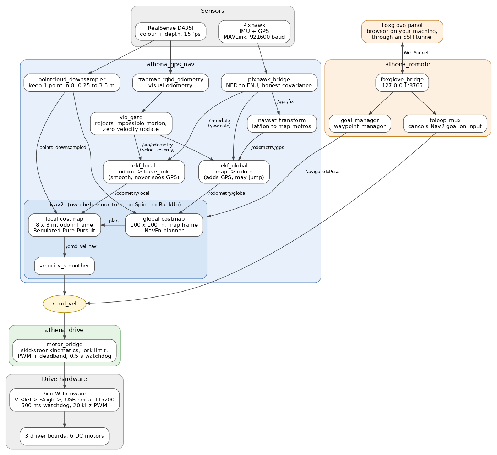

# Athena architecture

How the pieces fit: packages, data flow, frames, and the design decisions that
are not obvious from the code. To *run* the rover see the [root README](../README.md).
For depth on navigation see [athena_gps_nav/ARCHITECTURE.md](../athena_gps_nav/ARCHITECTURE.md).

Athena answers two questions with two chains that meet only in Nav2 (**where am
I?** and **what is around me?**), then acts on them. The separation is
deliberate: if GPS drops out, obstacle avoidance is untouched.



Source: [img/architecture.dot](img/architecture.dot) (`dot -Tpng -Gdpi=100`).

## Packages

| Package | Owns | Live? |
|---|---|---|
| [`athena_gps_nav`](../athena_gps_nav/README.md) | everything that reads a sensor, estimates a pose, keeps a costmap or plans a path. Output is `/cmd_vel`, a velocity | yes |
| [`athena_drive`](../athena_drive/README.md) | everything that ends in a motor turning: `/cmd_vel` -> PWM over serial, calibration, firmware. Knows nothing about goals, maps or GPS | yes |
| [`athena_remote`](../athena_remote/README.md) | everything an operator sees or presses, and remote access: Foxglove bridge, goal and waypoint nodes, teleop, captive-portal login. Not needed to navigate | yes |
| `athena_slam` | first-generation SLAM/GPS experiments, not launched by anything. Do not use for navigation: wrong IMU axes, 115200 baud, hard-coded `/dev/ttyACM0`, GPS as `geometry_msgs/Point` | no |
| [`drive`](../drive/README.md) | first-generation motor bridge. **Deprecated: never launch it.** It hardcodes `/dev/ttyACM1`, which is the Pixhawk about half the time | no |

The boundary is by purpose, not technology: a node that draws markers for the
operator lives in `athena_remote` even though it subscribes to navigation topics;
a node that reads a sensor lives in `athena_gps_nav` even if the sensor is bolted
to the drive system ([CONTRIBUTING.md](../CONTRIBUTING.md#1-the-five-packages)).

## Data flow

Sensors -> localization -> Nav2 -> `motor_bridge` -> Pico -> motors.

| Stage | Component | Output |
|---|---|---|
| Sensors | Pixhawk (IMU, GPS), RealSense D435i (colour, depth, camera IMU) | raw data |
| Perception (obstacles) | RealSense depth cloud -> `pointcloud_downsampler` (1 point in 8, 0.25-3.5 m) | `/camera/camera/depth/color/points_downsampled` |
| Perception (motion) | rtabmap `rgbd_odometry` -> `vio_gate` (drops impossible motion, zero-velocity update when stationary) | `/vio/odometry` |
| IMU / GPS | `pixhawk_bridge` (NED to ENU, covariance from HDOP) | `/imu/data`, `/gps/fix` |
| Localization | `ekf_local`, `ekf_global`, `navsat_transform` | `/odometry/local`, `/odometry/global`, `/odometry/gps`; TF |
| Nav2 | costmaps + NavFn planner + Regulated Pure Pursuit controller + velocity smoother | `/cmd_vel_nav` -> `/cmd_vel` |
| Drive | `motor_bridge` (skid-steer kinematics, jerk limit, PWM deadband) | `V <left> <right>` over USB serial |
| Actuation | Pico W firmware: slew limit, 20 kHz PWM, watchdog | six DC motors via three driver boards |

Operator inputs join at two points: goals enter Nav2 as `NavigateToPose` /
`/goal_pose` (from `goal_manager`, `waypoint_manager`, or an RViz click; Foxglove
clicks go to `/athena/goal_click` and `goal_manager` converts them into `map` once,
because Nav2 Humble re-transforms a goal at its original stamp and TF keeps only
10 s). `nav_status` watches every goal and publishes why it ended on
`/athena/nav_status`. And `teleop_mux` publishes `/cmd_vel` directly after cancelling any running
goal. `foxglove_bridge` serves the topics to the browser.

Measured rates with the whole stack up (2026-09-04), not what the drivers are
configured to attempt:

| Topic | What it is | Rate |
|---|---|---|
| `/imu/data` | Pixhawk IMU | 39 Hz (asks for 50) |
| `/gps/fix` | GPS position + honest covariance | 5 Hz |
| `/camera/camera/depth/color/points` | raw depth cloud | 7.0 Hz |
| `/camera/camera/depth/color/points_downsampled` | what both costmaps consume | 7.4 Hz |
| `/vio/odometry_raw` | rtabmap's output, before gating | |
| `/vio/odometry` | camera motion, gated | 9.7 Hz |
| `/odometry/local` | **smooth** pose, never jumps; used by the local costmap and controller | 19.5 Hz (asks for 30) |
| `/odometry/global` | **accurate** pose, GPS-corrected, may jump; absent under `local_only` | |
| `/odometry/gps` | `navsat_transform` output in map metres; ticks only with a real fix | |
| `/local_costmap/costmap` | obstacles near the rover | 1.5 Hz (asks for 2.0) |
| `/cmd_vel_nav` | the controller's raw output (only `controller_server` publishes it) | |
| `/cmd_vel` | velocity command to the motors; six publishers, so watch `/cmd_vel_nav` to see the controller | |

The ones short of their configured rate are the Jetson not keeping up, not a
misconfiguration; that headroom is what to spend from if anything heavy is added.

## Launch order

`bringup.launch.py` staggers the layers so each has what it depends on:

| Elapsed | Starts | Why then |
|---|---|---|
| 0 s | `sensors.launch.py`: robot description, RealSense driver, camera IMU filter, `pixhawk_bridge`, downsampler | nothing works without sensor data |
| 0 s | `athena_drive` `motor_bridge` | opens the Pico link, then waits for a `/cmd_vel` that only arrives once Nav2 is up |
| 5 s | `vio.launch.py`: rtabmap + `vio_gate` (only if `use_camera`) | needs camera images flowing |
| 8 s | `localization.launch.py`: both EKFs and `navsat_transform` | needs odometry and IMU to fuse |
| 12 s | `navigation.launch.py`: Nav2 | needs a position estimate before it can plan |
| 15 s | `athena_remote` `foxglove.launch.py` (unless `foxglove:=false`) | serves only what exists; early start means a panel of missing topics |

Allow about 40 s to settle. Bringup includes `athena_drive/launch/drive.launch.py`,
never the old `drive` package.

## Transform tree

```
map                         <- ekf_global: GPS corrections land here (static identity under local_only)
 └─ odom                    <- ekf_local: camera velocity + gyro; smooth, never sees GPS
     └─ base_link           chassis centre, 0.10 m above the ground
         ├─ base_footprint  ground projection (a CHILD of base_link, on purpose)
         ├─ camera_link     RealSense; camera_camera_link and the driver's own frames hang below
         ├─ imu_link        Pixhawk (orientation matters, translation is cosmetic)
         ├─ gps_link        antenna (position assumed, not measured)
         ├─ nose_marker     cosmetic: makes "forward" obvious in 3D
         └─ wheel_{front,mid,rear}_{left,right}    cosmetic
```

`map -> odom` belongs to filter 2 and `odom -> base_link` to filter 1, so a GPS
correction moves only the first link. `base_footprint` is a child because
`ekf_local` already publishes `odom -> base_link`: declaring it the other way gives
`base_link` two parents, TF2 orphans `base_footprint`, and every lookup throws
`ConnectivityException`. Nav2 here uses `robot_base_frame: base_link`. The
URDF places the sensors (`camera_link` at x 0.50, z 0.55; footprint 1.3 x 1.0 m;
track width 0.85 m); these numbers are load-bearing, so measure rather than guess
([camera mount](../athena_gps_nav/docs/TESTING.md#camera-mount)).

## Key design decisions

| Decision | Why | Detail |
|---|---|---|
| Two EKFs, local and global | the controller needs a pose that never jumps; waypoints need absolute accuracy; GPS corrections *are* jumps. Filter 1 never sees GPS, filter 2 adds it and absorbs jumps in `map -> odom` | [gps_nav ARCHITECTURE](../athena_gps_nav/ARCHITECTURE.md#why-two-filters-instead-of-one) |
| Visual odometry fused as **velocity**, never position | VO resets itself when tracking is lost; fusing position would yank the estimate each time. No Mahalanobis gate (it self-locks: one spike, then every honest sample is rejected). Plausibility filtering is in `vio_gate`, in m/s | `config/dual_ekf_navsat.yaml` |
| Visual odometry is the only translation source | no wheel encoders; drive is open loop and skid-steer turns slip, so heading and motion come from gyro and camera, never from wheel commands | [limits](../athena_drive/docs/MOTOR_BRIDGE.md#known-limitations) |
| No absolute yaw in either filter (gyro rate only) | the Pixhawk's attitude is unusable (flat, it reads roll -22 / pitch -15 degrees, inconsistent between sessions) and anchored `map` ~90 degrees off. Cost: map yaw is dead-reckoned, so GPS waypoint work needs a real heading source | [TUNING](../athena_gps_nav/docs/TUNING.md#heading-the-compass-is-not-used) |
| Depth camera is the only obstacle sensor | no lidar. 87 degree cone, nothing behind. Costmaps are rolling windows (no prior map): local 8 x 8 m @ 0.05 m in `odom`, global 100 x 100 m @ 0.1 m in `map` | [TUNING](../athena_gps_nav/docs/TUNING.md#obstacle-detection) |
| A blind camera stops the rover | `expected_update_rate: 2.0` on both observation sources: no cloud for 2 s marks the costmap not-current and the controller refuses to drive | [TUNING](../athena_gps_nav/docs/TUNING.md#obstacle-detection) |
| Own behaviour tree: no Spin, no BackUp | both move a 1.3 m rover through space it cannot see. Recovery is clear costmaps, wait 5 s, up to 6 rounds, then fail the goal and hand back to the operator | [TUNING](../athena_gps_nav/docs/TUNING.md#recovery-behaviour) |
| Fixed 1.0 m pure-pursuit lookahead, `odom_topic` on `/odometry/local` everywhere | velocity-scaled lookahead pins the carrot at its minimum when speed is 0, which was inside the footprint, so the controller read every goal as a turn | [TUNING](../athena_gps_nav/docs/TUNING.md#speed-and-steering) |
| `local_only` mode | with no fix, `ekf_global` dead-reckons the same inputs as `ekf_local`; two filters on identical inputs diverge, and that divergence is the indoor `map -> odom` drift. Drop it and pin `map -> odom` to identity | [gps_nav ARCHITECTURE](../athena_gps_nav/ARCHITECTURE.md#indoors-one-filter-not-two) |
| Stationary drift held at zero twice over | `Odom/FilteringStrategy` stays `0` (no feedback loop in rtabmap) and `vio_gate` republishes exact zero velocity when `/cmd_vel` says parked | [TUNING](../athena_gps_nav/docs/TUNING.md#visual-odometry-and-stationary-drift) |
| Datum latched after 45 s, optionally pinned | a just-booted receiver is still converging; the stock 3 s put the origin 110 m off | [TUNING](../athena_gps_nav/docs/TUNING.md#the-map-origin-must-come-from-a-settled-fix) |
| GPS covariance measured, not nominal | `sigma^2 = (HDOP x 1.74)^2 + 3.06^2`; the nominal formula under-reports by ~1.8x at good HDOP | [TUNING](../athena_gps_nav/docs/TUNING.md#how-hard-gps-pulls-the-map) |
| One PWM value per **side**, so one dead wheel is never software | `V <left> <right>` is the only drive command; per-motor state is only the invert flag | [FIRMWARE](../athena_drive/docs/FIRMWARE.md#commands) |
| Motor direction lives in the Pico's flash; speeds in `~/.config/athena_drive/params.yaml` | direction belongs to the wiring and so to the board; the config file sits outside the repo so a rebuild cannot wipe it. Precedence: argument > saved > built-in estimate | [CALIBRATION](../athena_drive/docs/CALIBRATION.md#where-the-settings-live) |
| Two independent watchdogs | `motor_bridge` zeroes after 0.5 s of stale `/cmd_vel`; the firmware stops after 500 ms of serial silence. Either alone leaves a gap (live node sending stale commands; dead cable with motors latched on) | [FIRMWARE](../athena_drive/docs/FIRMWARE.md#built-in-behaviour) |
| Jerk-limited velocity profile *and* firmware slew limit | shaping velocity in Nav2's units protects traction and the camera VO depends on; the slew limit is a safety net that works if the host misbehaves. Keep both | [MOTOR_BRIDGE](../athena_drive/docs/MOTOR_BRIDGE.md#velocity-profile) |
| Serial devices addressed by `/dev/serial/by-id`, never `ttyACM<n>` | numbers swap between boots; the Pixhawk and the Pico have each been `ttyACM0`. Prevents motor commands reaching the flight controller | [MOTOR_BRIDGE](../athena_drive/docs/MOTOR_BRIDGE.md#serial-port-and-firmware-handshake) |
| The Pico's serial port has one owner at a time | `motor_bridge`, `calibrate`, `wiring_check`, `calibrate_speed` all open it, and bringup starts a bridge. The loser fails quietly | [athena_drive README](../athena_drive/README.md#safety) |
| Foxglove bridge on loopback, reached by SSH tunnel | managed WiFi drops DDS multicast and isolates clients, but always allows one outbound TCP connection. The bridge has no authentication | [athena_remote README](../athena_remote/README.md#which-way-in) |
| `teleop_mux` cancels any Nav2 goal on input | autonomy and the operator never fight over the wheels; idle, it publishes nothing | [FOXGLOVE_PANEL](../athena_remote/docs/FOXGLOVE_PANEL.md#driving-it) |
| RealSense driver launched by absolute path | `~/.bashrc` also sources the unrelated `~/ros2_ws` with its own `realsense2_camera`; package-name resolution picks whichever is first on `AMENT_PREFIX_PATH` | `sensors.launch.py` |

## Hardware and devices

| Device | Connection | Read by |
|---|---|---|
| RealSense D435i | USB 3 (`8086:0b3a`) | `realsense2_camera_node` |
| Pixhawk PX4 FMU v2 | USB serial (`26ac:0011`), MAVLink at **921600** baud: `/dev/serial/by-id/usb-3D_Robotics_PX4_FMU_v2.x_0-if00` | `pixhawk_bridge` |
| Raspberry Pi Pico W | USB serial (`2e8a:f00a`), 115200 baud: `/dev/serial/by-id/usb-Raspberry_Pi_Pico*` | `athena_drive/motor_bridge` |

Pico wiring to the motor drivers: [athena_drive README](../athena_drive/README.md#pico-to-motor-driver-pin-map).

## When a sensor drops out

| Lost | What happens |
|---|---|
| GPS | `map` stops being corrected. Obstacle avoidance, the local costmap and `odom` keep working |
| Visual odometry | the filter coasts on the IMU; VO resets itself and rejoins |
| Camera | up to 2 s: no new obstacles, costmap keeps what it saw. Past `expected_update_rate` the costmap is not-current and the **controller stops driving** (deliberate) |
| Pixhawk | no yaw rate and no GPS; the camera alone still gives a usable local pose. Absolute heading is not fused even when it is healthy |
| `/cmd_vel` | `motor_bridge` stops the motors after 0.5 s; the Pico independently stops them 500 ms after that |

## Where to read next

| Topic | Document |
|---|---|
| How navigation works in depth: costmaps, filters, recovery, every file, measured results | [athena_gps_nav/ARCHITECTURE.md](../athena_gps_nav/ARCHITECTURE.md) |
| Run, tune, test, fix navigation | [athena_gps_nav/README.md](../athena_gps_nav/README.md) |
| Wire, calibrate, flash, debug the motors | [athena_drive/README.md](../athena_drive/README.md) |
| Control panel and remote access | [athena_remote/README.md](../athena_remote/README.md) |
| Where code lives, building, git workflow | [CONTRIBUTING.md](../CONTRIBUTING.md) |
